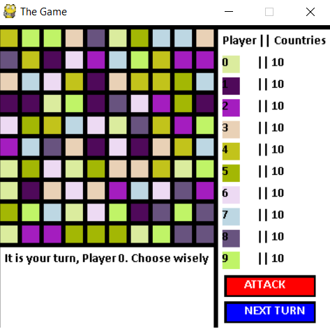

# Game

This is a game called Game. The world is caotic and not fare for everyone.
In this game, you will be one country, trying to conquer the rest of the world with your militar strategy.
Will a simple bot conquer you?

## How to setup
Run the setup.py file in your computer.
```
$ python setup.py install
```

Then run core.py file to start playing.

If you would like to contribute, pull requests are encouraged!

# Running the game
You can run this game in GitPod as well
[](https://gitpod.io/#https://github.com/inimaz/Game) 
    
	
## Example
